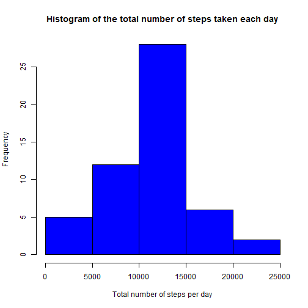
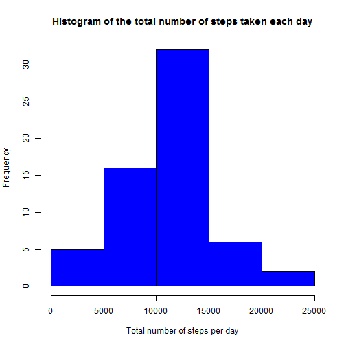
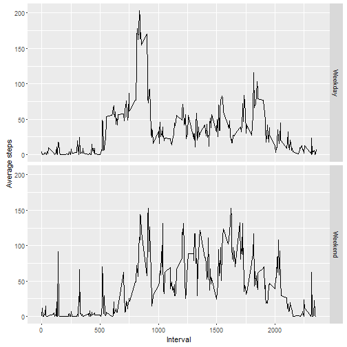

##Loading and preprocessing the data
First, Download the "Activity.csv" file form course repository and set the working directory as the floder containing the "activity.csv" file. 


```r
Activity <- read.csv("Activity.csv")
Activity$steps <- as.numeric(Activity$steps)
```

##What is mean total number of steps taken per day?


```r
Totalsteps<- aggregate(steps~date, Activity, sum, rm.na = TRUE)

hist(Totalsteps$steps, main = "Histogram of the total number of steps taken each day", xlab = "Total number of steps per day", col = "blue")
```



```r
summary(Totalsteps$steps)    
```

```
##    Min. 1st Qu.  Median    Mean 3rd Qu.    Max. 
##      42    8842   10770   10770   13300   21200
```

The mean and median of the total number of steps taken per day is **10770** steps. 

## What is the average daily activity pattern?


```r
Totalstepsinterval <- read.csv("Activity.csv")
Totalstepsinterval$steps <- as.numeric(Totalstepsinterval$steps)
Totalstepsinterval <- aggregate(steps~interval, Totalstepsinterval, mean, na.rm = TRUE)
plot(Totalstepsinterval$interval, Totalstepsinterval$steps, type = "l", xlab = "Interval", ylab = "Average steps")
```


```r
Totalstepsinterval$interval[which.max(Totalstepsinterval$steps)]
```

```
## [1] 835
```

The **835th** interval is the 5 minute interval which contains the maximum number of steps on average. 

## Imputing missing values


```r
Activitymeancor <- read.csv("Activity.csv")
Activitymeancor$steps <- as.numeric(Activitymeancor$steps)
sum(is.na(Activitymeancor$steps))
```

```
## [1] 2304
```

```r
paste(100*sum(is.na(Activitymeancor$steps))/length(Activitymeancor$steps),"%",sep="")
```

```
## [1] "13.1147540983607%"
```

In total there are about **2304** missing values in the data set which is about 13.12% of the total data. 

The method used to impute the missings values is predictive mean matching. 


```r
library(mice)
tempData1 <- mice(Activitymeancor,m=1,maxit=50,meth='pmm',seed=500)
```

```
## 
##  iter imp variable
##   1   1  steps
##   2   1  steps
##   3   1  steps
##   4   1  steps
##   5   1  steps
##   6   1  steps
##   7   1  steps
##   8   1  steps
##   9   1  steps
##   10   1  steps
##   11   1  steps
##   12   1  steps
##   13   1  steps
##   14   1  steps
##   15   1  steps
##   16   1  steps
##   17   1  steps
##   18   1  steps
##   19   1  steps
##   20   1  steps
##   21   1  steps
##   22   1  steps
##   23   1  steps
##   24   1  steps
##   25   1  steps
##   26   1  steps
##   27   1  steps
##   28   1  steps
##   29   1  steps
##   30   1  steps
##   31   1  steps
##   32   1  steps
##   33   1  steps
##   34   1  steps
##   35   1  steps
##   36   1  steps
##   37   1  steps
##   38   1  steps
##   39   1  steps
##   40   1  steps
##   41   1  steps
##   42   1  steps
##   43   1  steps
##   44   1  steps
##   45   1  steps
##   46   1  steps
##   47   1  steps
##   48   1  steps
##   49   1  steps
##   50   1  steps
```

```r
Activitymeancor <- complete(tempData1,1)

Totalstepscor<- aggregate(steps~date, Activitymeancor, FUN = sum, rm.na = TRUE )

hist(Totalstepscor$steps, main = "Histogram of the total number of steps taken each day", xlab = "Total number of steps per day", col = "blue", freq = TRUE)
```



```r
summary(Totalstepscor$steps) 
```

```
##    Min. 1st Qu.  Median    Mean 3rd Qu.    Max. 
##      42    8842   10600   10730   13300   21200
```

After imputing missing values the median (**10600**)and the mean (**10730**) of the total steps taken each day has decreased slightly. 

## Are there differences in activity patterns between weekdays and weekends?


```r
library(ggplot2)
Activitymeancorwd <- Activitymeancor
Activitymeancorwd$date <- as.Date(Activitymeancorwd$date,"%Y-%m-%d")
Activitymeancorwd$dofw <- weekdays(Activitymeancorwd$date)
Activitymeancorwd$dofw <- gsub("Monday", "Weekday", Activitymeancorwd$dofw, ignore.case = FALSE)
Activitymeancorwd$dofw <- gsub("Tuesday", "Weekday", Activitymeancorwd$dofw, ignore.case = FALSE)
Activitymeancorwd$dofw <- gsub("Wednesday", "Weekday", Activitymeancorwd$dofw, ignore.case = FALSE)
Activitymeancorwd$dofw <- gsub("Thursday", "Weekday", Activitymeancorwd$dofw, ignore.case = FALSE)
Activitymeancorwd$dofw <- gsub("Friday", "Weekday", Activitymeancorwd$dofw, ignore.case = FALSE)
Activitymeancorwd$dofw <- gsub("Saturday", "Weekend", Activitymeancorwd$dofw, ignore.case = FALSE)
Activitymeancorwd$dofw <- gsub("Sunday", "Weekend", Activitymeancorwd$dofw, ignore.case = FALSE)


Totalstepscorwd <- aggregate(steps~interval+dofw, Activitymeancorwd, mean)

qplot(interval, steps, data = Totalstepscorwd, facets = dofw ~., geom = "line", xlab = "Interval", ylab = "Average steps")
```




